# INSTRUCTIVO — Automatización Gmail → Make → Google Sheets

**Guía II · Corte II · Optativa II** — ING. Jairo Armando Salcedo Aranda
**Ejecutado el 16 de septiembre de 2026** · Cuenta: `wildermangt@gmail.com`

> Este instructivo documenta la automatización **realmente construida y funcionando**.
> Cada paso incluye la captura del momento en que se ejecutó.

---

## Datos del montaje

| Elemento | Valor |
|---|---|
| Escenario en Make | `Gmail a Google Sheets - Guia II Corte II` |
| ID del escenario | `6302474` |
| Equipo Make | `2972430` |
| Hoja de cálculo | `CONEXIÓN A MAKE` |
| ID de la hoja | `14G7JmQrZwtc0SHKIPibgZxFtSnELhnoC-L5j8dc5NM4` |
| Pestaña | `Untitled` |
| Estado | **Activo** · cada 15 minutos |

**Enlaces:**
- Escenario: https://us2.make.com/2972430/scenarios/6302474
- Hoja: https://docs.google.com/spreadsheets/d/14G7JmQrZwtc0SHKIPibgZxFtSnELhnoC-L5j8dc5NM4/edit

---

## PASO 1 · Crear la hoja de Google Sheets

Hoja **`CONEXIÓN A MAKE`** con los 5 encabezados en la fila 1:

`Fecha` · `Remitente` · `Asunto` · `Correo` · `Contenido`

---

## PASO 2 · Entrar a Make y crear el escenario

Se abre el constructor con el lienzo vacío y el botón **(+)** morado al centro.

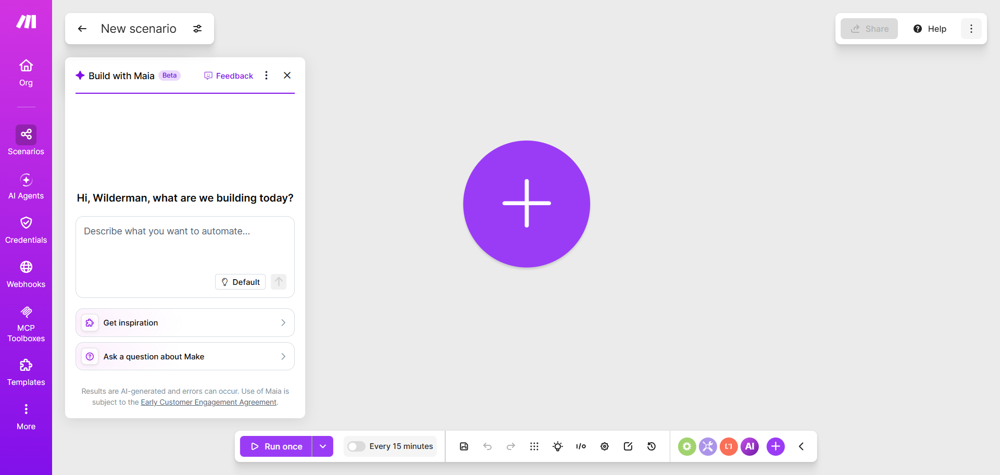

---

## PASO 3 · Agregar Gmail

Clic en el **(+)** → se abre el selector de aplicaciones → elegir **Gmail**.

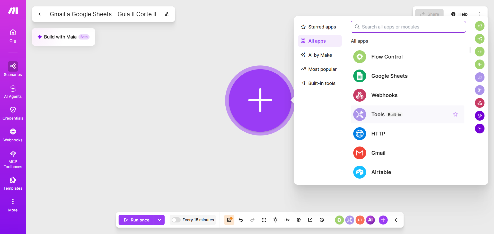

En la lista de módulos, bajo **Triggers**, elegir **Watch emails**
*(«Triggers when a new email is received in your mailbox»)*.

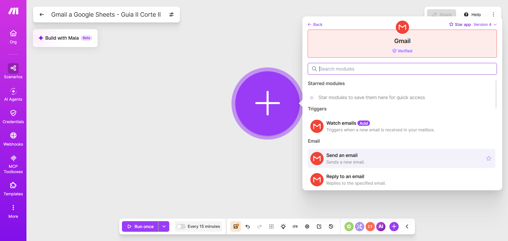

> ⚠️ Debe ser **Watch emails**, no *Send an email*. La guía exige que el
> disparador **detecte** correos nuevos.

---

## PASO 4 · Crear la conexión con Gmail

En el panel del módulo, clic en **Create a connection**.

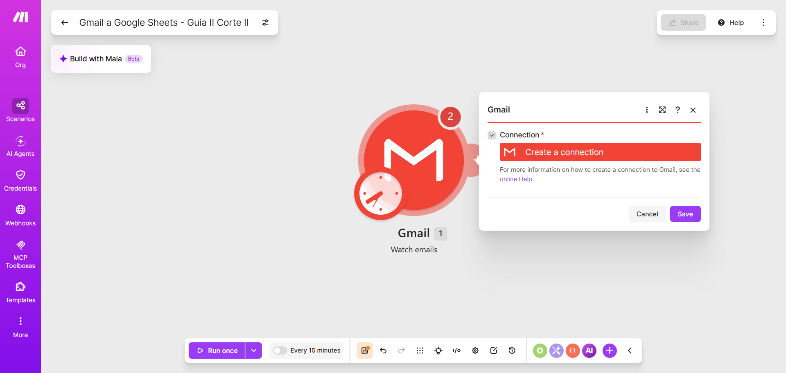

Nombrarla **`CONEXIÓN CON GMAIL`** y pulsar **Sign in with Google**.

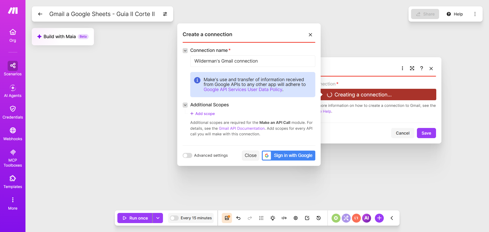

Google pide autorización. Aquí concede a Make:
- Ver mensajes de correo y parámetros de configuración
- Leer, redactar y enviar correos desde la cuenta

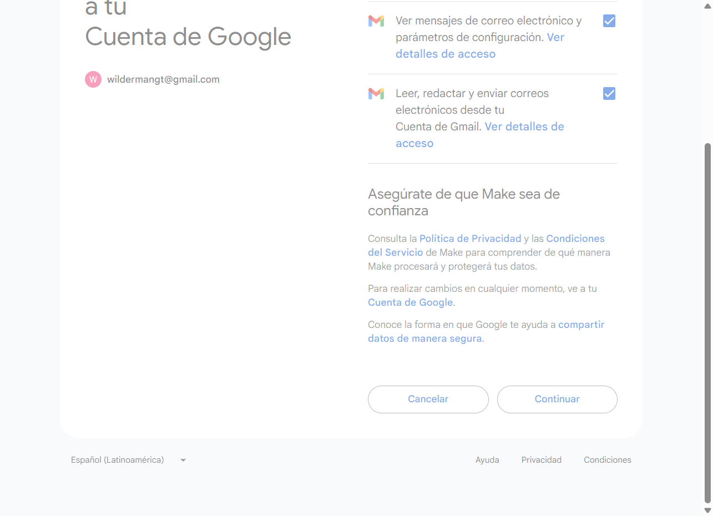

---

## PASO 5 · Configurar *Watch emails*

| Campo | Valor usado |
|---|---|
| Connection | `CONEXIÓN CON GMAIL` |
| Filter type | `Simple filter` |
| Folder | `System folders: Inbox` |
| Criteria | `All messages` |
| Mark as read when fetched | `No` |
| **Limit** | **`1`** ← bajado de 10 para cuidar el plan gratuito |

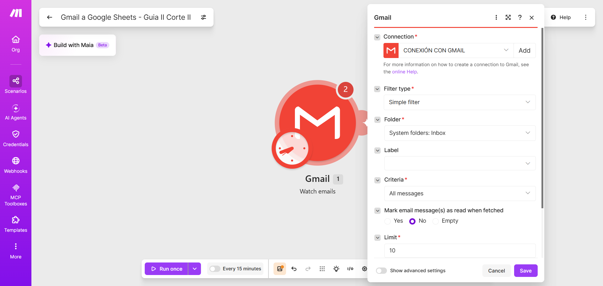

Make pregunta desde qué punto procesar. Se eligió **From now on**
(solo correos nuevos, sin arrastrar el historial).

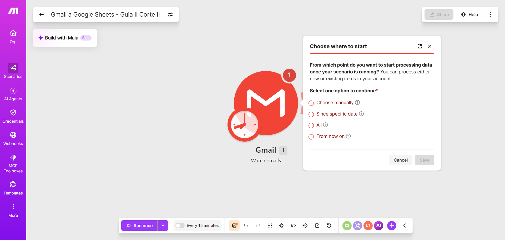

Módulo Gmail listo en el lienzo:

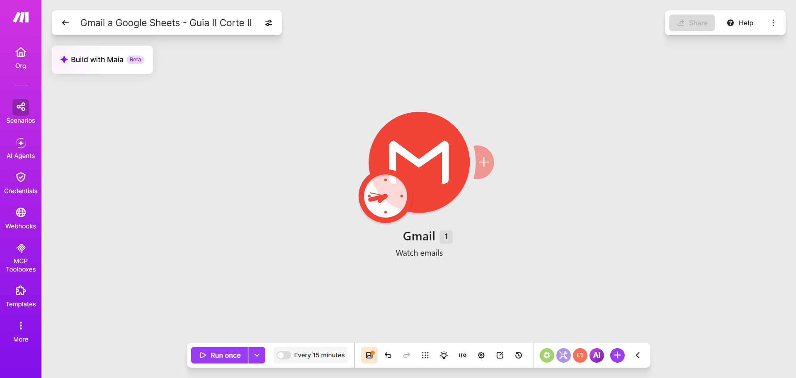

---

## PASO 6 · Encadenar Google Sheets

Clic en el **+** del conector a la derecha de Gmail → elegir **Google Sheets**.

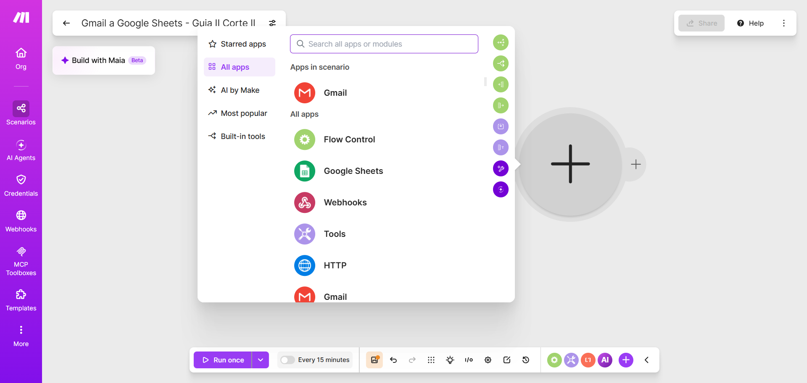

Bajo **Rows**, elegir **Add a Row** *(«Appends a new row to the bottom of the table»)*.

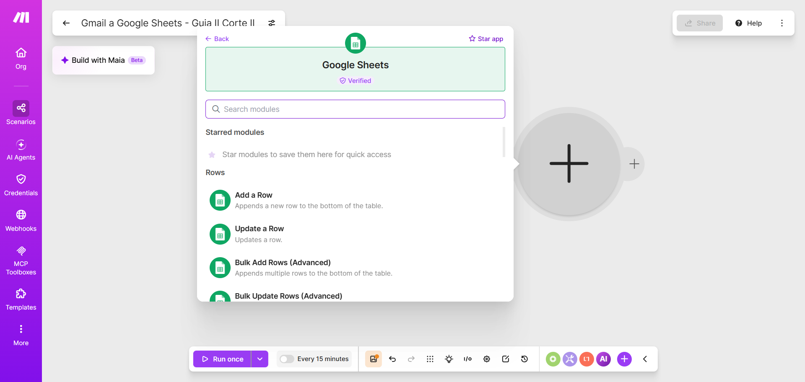

Los dos módulos ya encadenados:

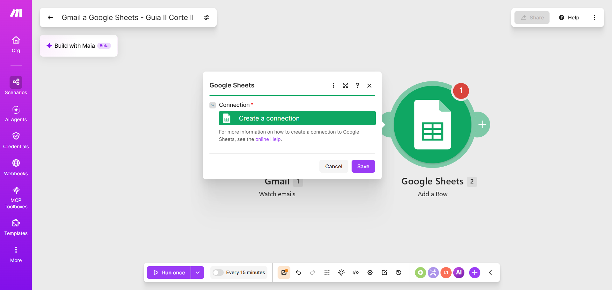

---

## PASO 7 · Configurar *Add a Row*

| Campo | Valor |
|---|---|
| Connection | conexión de Google |
| Search Method | `Search by path` |
| Drive | `My Drive` |
| Spreadsheet Name | `CONEXIÓN A MAKE` |
| Sheet Name | `Untitled` |
| Table contains headers | `Yes` |

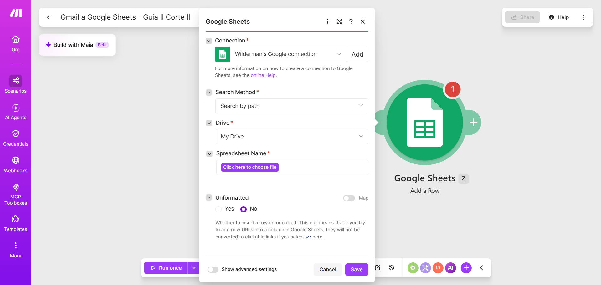

---

## PASO 8 · Mapear las 5 columnas ⭐

Make lee los encabezados de la hoja y muestra los campos como
`Fecha (A)`, `Remitente (B)`, `Asunto (C)`, `Correo (D)`, `Contenido (E)`.

**Nombres reales de las variables de Gmail** *(verificados en el panel de variables)*:

| Columna | Variable | Etiqueta en Make |
|---|---|---|
| **Fecha (A)** | `{{1.internalDate}}` | Date |
| **Remitente (B)** | `{{1.fromName}}` | From (name) |
| **Asunto (C)** | `{{1.subject}}` | Subject |
| **Correo (D)** | `{{1.fromEmail}}` | From (email) |
| **Contenido (E)** | `{{1.fullTextBody}}` | Full text body |

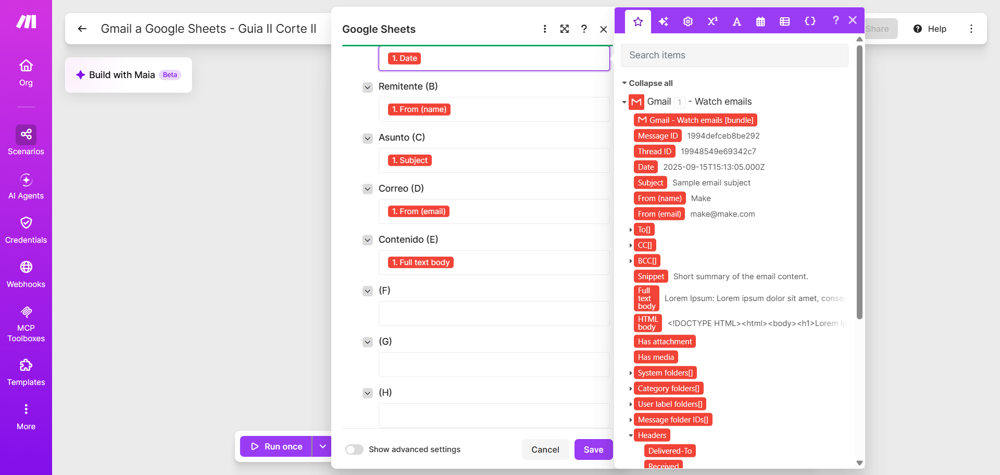

> 🔴 **El error más común de esta guía.** Los nombres intuitivos
> (`1.date`, `1.from.name`, `1.from.address`, `1.text`) **no existen** y dejan
> las columnas vacías sin mostrar ningún error. Si al escribir la variable
> **no se pinta como píldora roja**, el nombre está mal.
> Lo seguro es insertarlas desde el panel lateral de variables, no escribirlas.

---

## PASO 9 · Escenario completo

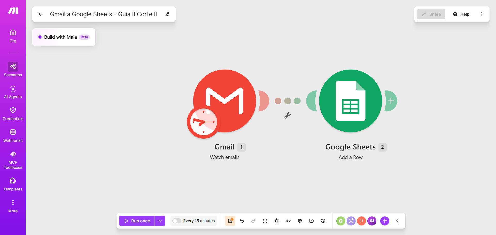
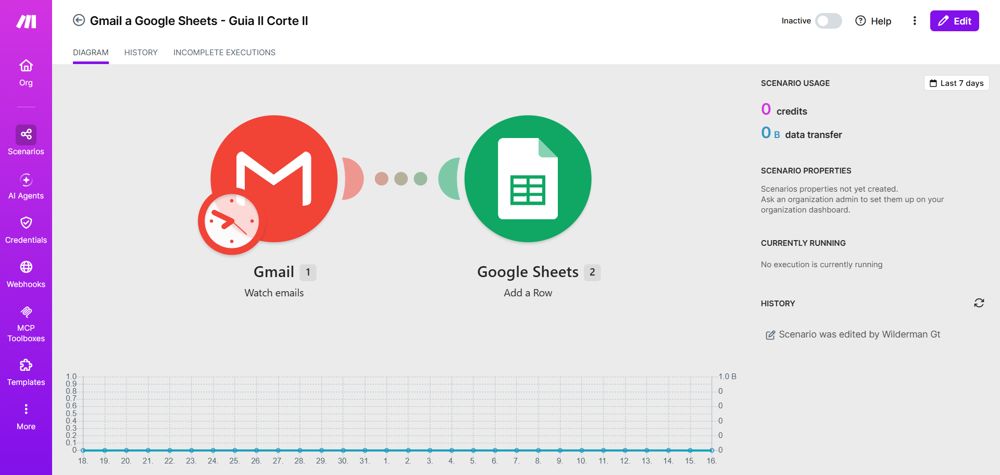

---

## PASO 10 · Enviar el correo de prueba

Correo enviado a la misma cuenta con asunto
**«Prueba de automatizacion desde Make»**.

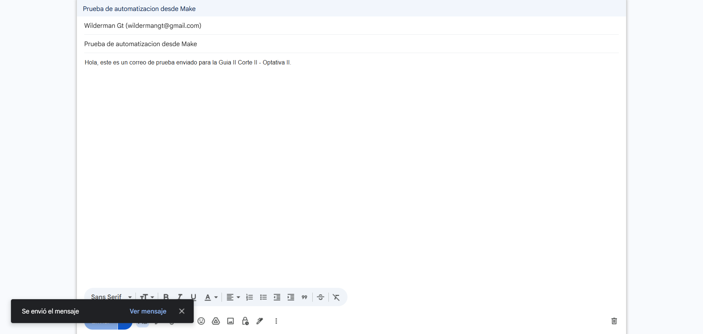

---

## PASO 11 · Activar cada 15 minutos

Interruptor **Every 15 minutes** encendido y escenario guardado.
El escenario queda en estado **Active**.

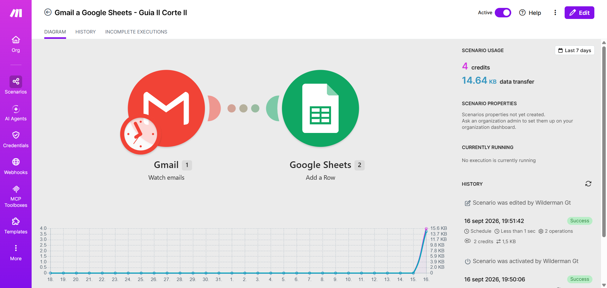

---

## PASO 12 · Resultado: registro automático ✅

La hoja recibió **dos filas escritas automáticamente**, sin intervención manual:

| Fila | Fecha | Remitente | Asunto | Correo |
|---|---|---|---|---|
| 2 | 2026-09-17T00:43:55Z | Google | Alerta de seguridad | no-reply@accounts.google.com |
| 3 | 2026-09-17T00:4… | Wilderman Gt | Prueba de automatizacion desde Make | wildermangt@gmail.com |

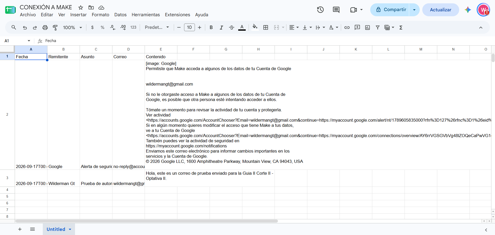

**El flujo quedó demostrado:** `Gmail → Make → Google Sheets → Registro automático`

---

## Entregables

| # | Entregable | Captura |
|---|---|---|
| 1 | Escenario completo | `16-escenario-completo.png` · `19-vista-escenario.png` |
| 2 | Configuración de Gmail | `07-watch-emails-config.png` |
| 3 | Google Sheets | `21-datos-registrados.png` |
| 4 | Ejecución | `20-escenario-activo.png` |
| 5 | Datos registrados automáticamente | `21-datos-registrados.png` |
| 6 | El docente verifica la conexión | escenario activo, listo para mostrar |

---

## ⚠️ Pendientes tuyos

1. **Desactiva el escenario** cuando el docente termine de verificar.
   Activo cada 15 min consume ~2.880 operaciones/mes: **el triple del cupo gratuito
   de 1.000**. Ver `PLAN-GRATUITO.md`.

2. **Revoca el acceso de Make si dejas de usarlo:**
   https://myaccount.google.com/permissions

3. **Cierra la ventana de Chrome con depuración** que se abrió para este montaje
   (perfil `chrome-make`, puerto 9222).
